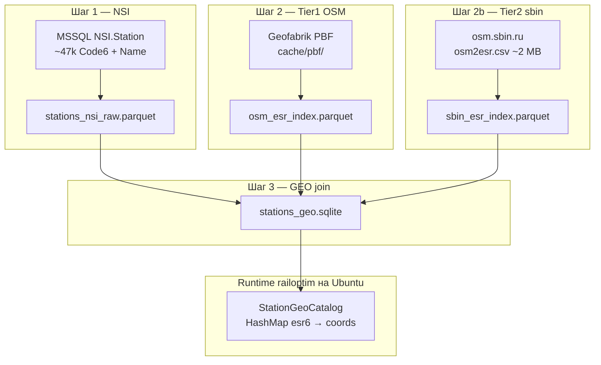

# Справочник станций ЕСР + координаты

Production-справочник **Code6 (ЕСР-6) + название + lat/lon** для карты и lookup в `railoptim`.

**Среда prod:** сервис `railoptim` и ETL станций развёрнуты на **Ubuntu Linux** (команды ниже — из корня репозитория на prod-сервере). macOS — только для локальной разработки.

Итоговый артефакт — [`stations_geo.sqlite`](stations_geo.sqlite): только станции из NSI, для которых найдены валидные координаты. Имя станции всегда из **NSI** (`Name`), координаты — из внешних источников (OSM / sbin).

Код ETL: [`scripts/stations/`](../scripts/stations/) · загрузка в Rust: [`src/data/stations_geo.rs`](../src/data/stations_geo.rs)

---

## Содержание

1. [Архитектура](#архитектура)
2. [Зависимости](#зависимости)
3. [Среда prod (Ubuntu Linux)](#среда-prod-ubuntu-linux)
4. [Быстрый старт](#быстрый-старт)
5. [Pipeline по шагам](#pipeline-по-шагам)
6. [Источники координат (Tier 1 / 2 / 3)](#источники-координат-tier-1--2--3)
7. [Join и приоритеты](#join-и-приоритеты)
8. [Конфигурация в `data/stations/`](#конфигурация-в-datastations)
9. [Артефакты и отчёты](#артефакты-и-отчёты)
10. [Примеры данных](#примеры-данных)
11. [Скрипты и сеть](#скрипты-и-сеть)
12. [Структура `scripts/stations/`](#структура-scriptsstations)
13. [Интеграция с Rust](#интеграция-с-rust)
14. [Проверка и QA](#проверка-и-qa)
15. [Типовые сценарии](#типовые-сценарии)
16. [Устранение проблем](#устранение-проблем)
17. [Roadmap (Tier 3)](#roadmap-tier-3)

---

## Архитектура

Гибридная схема: **Python ETL offline** (на Ubuntu prod) → **SQLite** → **Rust lookup** при старте `railoptim`.



**Принципы:**

- В SQLite попадают **только** станции с координатами (нет «пустых» строк).
- `esr6` нормализуется до 6 цифр с ведущими нулями (`63000` → `063000`); паритет Python/Rust — [`src/data/esr.rs`](../src/data/esr.rs).
- Классификация по стране/региону — по первым двум цифрам Code6 ([`esr_country_prefixes.csv`](esr_country_prefixes.csv)).
- ~**80%** станций NSI — Россия (`region_group=ru`); Tier2 (sbin) критичен для покрытия РФ.

---

## Зависимости

На **Ubuntu prod** используйте `apt` + `pip3` (см. также [Среда prod](#среда-prod-ubuntu-linux)). На macOS — `brew` + `pip`.

**libosmium** — нативная библиотека для парсинга OSM PBF (шаг Tier1). Без неё `import osmium` / `build-osm` не заработает.

**Ubuntu** (prod-сервер):

```bash
sudo apt-get update
sudo apt-get install -y libosmium2-dev pybind11-dev python3-pip
pip3 install -r scripts/stations/requirements-stations.txt
```

**macOS** (локальная разработка):

```bash
brew install libosmium
pip install -r scripts/stations/requirements-stations.txt
```

**MSSQL** (шаг 1) — тот же `pymssql`, что для `src/data/dislocations.py` (не в `requirements-stations.txt`, ставится отдельно в prod-окружении).

Опционально для разработки пакета:

```bash
pip install -e scripts/stations   # pyproject.toml, пакет stations_etl
```

Shell-скрипты выставляют `PYTHONPATH=scripts/stations` автоматически ([`_python_env.sh`](../scripts/stations/_python_env.sh)).

На Ubuntu в shell-скриптах используется **`python3`** (см. [`_python_env.sh`](../scripts/stations/_python_env.sh)).

---

## Среда prod (Ubuntu Linux)

ETL и бинарник **`railoptim`** работают на одном **Ubuntu** prod-сервере (offline-машина с Infisical + MSSQL). Команды ниже — из **корня репозитория** (`/path/to/railoptim`).

### Первичная настройка (один раз)

```bash
cd /path/to/railoptim

# системные пакеты для Tier1 OSM (libosmium) и сборки pyosmium
sudo apt-get update
sudo apt-get install -y libosmium2-dev pybind11-dev python3-pip

# Python-зависимости ETL
pip3 install -r scripts/stations/requirements-stations.txt

# pymssql для fetch-nsi (как для dislocations.py)
pip3 install pymssql

# Infisical CLI + keyring — для fetch-nsi (см. auth-infisical.sh в репозитории)
# Rust-бинарник railoptim — cargo build --release (stations_geo.sqlite читается при старте)
```

### Диск и пути

| Путь | Размер (ориентир) | Назначение |
|------|-------------------|------------|
| `data/stations/cache/pbf/` | **десятки GB** (russia-latest ~4 GB + регионы) | Geofabrik PBF |
| `data/stations/cache/sbin/` | ~2 MB | кэш osm2esr.csv |
| `data/stations/stations_geo.sqlite` | ~10–20 MB | **runtime** lookup для `railoptim` |

Убедитесь, что на разделе с `data/stations/` достаточно места перед `./scripts/stations/run.sh download-pbf`.

### Сеть на prod

На Ubuntu prod действуют те же режимы, что в разделе [Скрипты и сеть](#скрипты-и-сеть):

- **`fetch-nsi`** — proxy-trap + локальный Infisical (`127.0.0.1:9000`), MSSQL в `no_proxy`
- **`download-pbf` / `build-osm` / `build-sbin`** — прямой интернет (`clear_proxy` в shell)
- **`build-geo`** — без сети

### Cron / периодическое обновление (пример)

```bash
# /etc/cron.weekly/railoptim-stations-geo — полная пересборка (ночь, воскресенье)
0 3 * * 0 cd /path/to/railoptim && ./scripts/stations/build_all.sh prod >> /var/log/railoptim-stations-etl.log 2>&1
```

После успешного ETL перезапустите сервис `railoptim`, чтобы подхватить новый `stations_geo.sqlite` (или задайте `STATIONS_GEO_DB`).

---

## Быстрый старт

На **Ubuntu prod** выполняйте команды из корня репозитория (`cd /path/to/railoptim`). См. [Среда prod](#среда-prod-ubuntu-linux).

### Полный pipeline (prod)

```bash
cd /path/to/railoptim
./scripts/stations/build_all.sh prod
```

Последовательность: **NSI → OSM PBF → sbin → SQLite** (4 шага, см. ниже).

### По шагам

```bash
./scripts/stations/run.sh prod fetch-nsi      # 1. MSSQL → parquet (proxy-trap + Infisical)
./scripts/stations/run.sh download-pbf        # 2a. скачать PBF
./scripts/stations/run.sh build-osm --index   # 2b. Tier1: PBF → osm_esr_index.parquet
./scripts/stations/run.sh build-sbin          # 2c. Tier2: sbin → sbin_esr_index.parquet
./scripts/stations/run.sh build-geo           # 3. join → stations_geo.sqlite (оффлайн OK)
```

### Проверка результата

```bash
./scripts/stations/run.sh sample-geo --n 30
cat data/stations/build_report.json | head -40
```

Диспетчер всех команд: [`scripts/stations/run.sh`](../scripts/stations/run.sh)

---

## Pipeline по шагам

### Шаг 1/4 — NSI (MSSQL → parquet)

| | |
|---|---|
| **Скрипт** | [`fetch-nsi.sh`](../scripts/stations/fetch-nsi.sh) · `run.sh prod fetch-nsi` |
| **CLI** | [`bin/fetch_nsi.py`](../scripts/stations/bin/fetch_nsi.py) |
| **Сеть** | proxy-trap (`127.0.0.1:1`) + Infisical localhost:9000 |
| **Infisical** | да (`dev` / `prod` / `staging`) |

**Запрос:** `SELECT Code6, Name FROM NSI.Station (NOLOCK)`

**Секреты Infisical** (те же имена, что для `dislocations.py`):

| Переменная | Назначение |
|------------|------------|
| `MSSQL_SERVER_MSKASUVPL` | хост MSSQL |
| `DOMAIN_USER` | логин |
| `PASSWORD` | пароль |
| `MSSQL_DB_ASUVP` | база |
| `MSSQL_DOMAIN` | опциональный префикс к логину |

**Обработка:**

- нормализация `Code6` → `esr6` (6 цифр);
- дедупликация по `esr6` (при нескольких именах — самое длинное);
- классификация `country_hint` / `region_group` по [`esr_country_prefixes.csv`](esr_country_prefixes.csv);
- проверка контрольной цифры ЕСР (`checksum_valid`).

**Выход:**

- [`stations_nsi_raw.parquet`](stations_nsi_raw.parquet)
- [`fetch_report.json`](fetch_report.json)

**Тест без MSSQL:**

```bash
./scripts/stations/run.sh fetch-nsi --input-csv scripts/stations/tests/fixtures/test_nsi_sample.csv
```

---

### Шаг 2/4 — Tier1 OSM (Geofabrik PBF → parquet)

| | |
|---|---|
| **Скрипты** | [`download-pbf.sh`](../scripts/stations/download-pbf.sh) + [`build-osm.sh`](../scripts/stations/build-osm.sh) |
| **CLI** | [`bin/build_osm_index.py`](../scripts/stations/bin/build_osm_index.py) |
| **Сеть** | интернет, proxy **снят** |
| **Infisical** | нет |

**Манифест регионов:** [`geofabrik_regions.yaml`](geofabrik_regions.yaml) — Russia, CIS, Baltic, Caucasus, Mongolia; optional China с bbox-фильтром.

**PBF-кэш:** `cache/pbf/*.osm.pbf` (gitignored, **десятки GB** на prod — см. [диск](#диск-и-пути)).

**Извлечение из OSM:**

- объекты `railway=station|halt|stop`;
- коды ЕСР из тегов (приоритет): `ref` → `uic_ref` → `esr:user` → `railway:ref`;
- значения через `;` или `,` разбиваются на несколько esr6;
- merge дубликатов: выше `pbf_priority` (manifest) → `railway` (station > halt) → приоритет тега.

**Выход:**

- [`osm_esr_index.parquet`](osm_esr_index.parquet) — `source=osm_pbf`
- [`osm_index_report.json`](osm_index_report.json)

**Полезные флаги:**

```bash
./scripts/stations/run.sh build-osm --index              # только index из cache (без download)
./scripts/stations/run.sh build-osm --regions russia,moldova
./scripts/stations/run.sh build-osm --include-optional # china-latest ~1.3 GB
./scripts/stations/run.sh download-pbf --force-download
```

---

### Шаг 2b/4 — Tier2 sbin (osm.sbin.ru → parquet)

| | |
|---|---|
| **Скрипт** | [`build-sbin.sh`](../scripts/stations/build-sbin.sh) · `run.sh build-sbin` |
| **CLI** | [`bin/build_sbin_index.py`](../scripts/stations/bin/build_sbin_index.py) |
| **Источник** | [http://osm.sbin.ru/esr/osm2esr.csv](http://osm.sbin.ru/esr/osm2esr.csv) (~2 MB) |
| **Сеть** | интернет, proxy **снят** |
| **Infisical** | нет |

**Зачем:** OSM PBF не покрывает все ~47k станций NSI, особенно в РФ. [osm.sbin.ru/esr](http://osm.sbin.ru/esr/) — curated-индекс ЕСР↔OSM (~18k unique esr6, ~79% покрытие РФ по их статистике).

**CSV-колонки:** `esr`, `status`, `type`, `osm_id`, `lat`, `lon`, `name`, …, `railway`

| status | Значение |
|--------|----------|
| `1` | однозначное соответствие OSM ↔ ЕСР |
| `2` | неоднозначное (несколько OSM-объектов на один esr6) |

**Merge в индексе:** status=1 > status=2; затем `station` > `halt` > `stop`.

**Кэш CSV:** `cache/sbin/osm2esr.csv`

**Выход:**

- [`sbin_esr_index.parquet`](sbin_esr_index.parquet) — `source=osm_sbin`, `confidence=0.95` (status=1) или `0.75` (status=2)
- [`sbin_index_report.json`](sbin_index_report.json)

**Пример отчёта:** ~19 957 candidates → ~18 269 unique esr6.

```bash
./scripts/stations/run.sh build-sbin --index           # только из cache CSV
./scripts/stations/run.sh build-sbin --force-download
```

---

### Шаг 3/4 — GEO join (parquet → SQLite)

| | |
|---|---|
| **Скрипт** | [`build-geo.sh`](../scripts/stations/build-geo.sh) · `run.sh build-geo` |
| **CLI** | [`bin/build_stations_geo.py`](../scripts/stations/bin/build_stations_geo.py) |
| **Сеть** | **оффлайн** |
| **Infisical** | нет |

Join NSI + Tier1 + Tier2 → SQLite + отчёты.

**Выход:**

- [`stations_geo.sqlite`](stations_geo.sqlite) — **prod**
- [`build_report.json`](build_report.json)
- [`unmatched_esr6.csv`](unmatched_esr6.csv) — NSI без coords ни в Tier1, ни Tier2
- [`cross_border_esr6_conflicts.csv`](cross_border_esr6_conflicts.csv) — расхождение `region_group` NSI vs OSM

**Флаги:**

```bash
./scripts/stations/run.sh build-geo --no-sbin    # только Tier1 OSM PBF
./scripts/stations/run.sh build-geo --nsi /path/to/custom.parquet
```

Если `sbin_esr_index.parquet` отсутствует — join идёт только по Tier1 (warning в stderr).

---

## Источники координат (Tier 1 / 2 / 3)

| Tier | Источник | Артефакт | Охват | Статус |
|------|----------|----------|-------|--------|
| **1** | OSM Geofabrik PBF | `osm_esr_index.parquet` | мультирегион (RU, CIS, Baltic, Caucasus, MN) | ✅ |
| **2** | [osm.sbin.ru/esr](http://osm.sbin.ru/esr/) | `sbin_esr_index.parquet` | ~18k esr6, в основном RU + СНГ | ✅ |
| **3** | Wikidata P2815 | — | baltic, cis, caucasus, cn/mn | ❌ не реализовано |

**Лицензии:** OSM — ODbL; sbin — данные OSM, проект GPL 3.0 ([исходники](https://github.com/shurshur/osmesr/)).

---

## Join и приоритеты

Для каждой строки NSI (`esr6`):

1. Ищем координаты в **Tier1** (`osm_esr_index.parquet`).
2. Если не найдено — ищем в **Tier2** (`sbin_esr_index.parquet`).
3. Если coords валидны (`|lat|≤90`, `|lon|≤180`) — пишем строку в SQLite.
4. Иначе — в `unmatched_esr6.csv`.

**Имя в SQLite** — всегда `name_nsi` из NSI, не OSM/sbin.

**Поля `source` в SQLite:**

| source | Откуда |
|--------|--------|
| `osm_pbf` | Tier1, Geofabrik extract |
| `osm_sbin` | Tier2, osm.sbin.ru |

Tier1 **всегда** побеждает при совпадении esr6: sbin не перезаписывает OSM PBF.

**confidence:** 1.0 (OSM PBF по умолчанию), 0.95/0.75 (sbin), понижается до 0.8 при cross-border конфликте `region_group`.

---

## Конфигурация в `data/stations/`

### [`esr_country_prefixes.csv`](esr_country_prefixes.csv)

Маппинг **первых 2 цифр** Code6 → `country_iso` + `region_group`.

| region_group | Примеры |
|--------------|---------|
| `ru` | default для неперечисленных районов (РФ) |
| `cis` | BY, KZ, UA, MD, UZ, … |
| `baltic` | LV, LT, EE |
| `south_caucasus` | GE, AM, AZ |
| `china_mongolia` | MN, CN (хвост) |

Используется на шаге NSI и в отчётах `coverage_by_region_group`.

### [`geofabrik_regions.yaml`](geofabrik_regions.yaml)

Манифест Geofabrik-регионов для Tier1.

| Поле | Описание |
|------|----------|
| `id` | идентификатор (`russia`, `belarus`, …) |
| `geofabrik_slug` | путь на download.geofabrik.de |
| `region_group` | группа для отчётов |
| `priority` | при merge перекрытий: **больше = выше** |
| `required` | обязателен для `--index` без download |
| `optional` | пропускается без `--include-optional` |
| `bbox` | фильтр координат при extract (China) |

### `cache/` (gitignored)

| Путь | Содержимое |
|------|------------|
| `cache/pbf/` | Geofabrik `.osm.pbf` |
| `cache/sbin/` | `osm2esr.csv` |

---

## Артефакты и отчёты

### Parquet / SQLite (gitignored, кроме конфигов)

| Файл | Шаг | Описание |
|------|-----|----------|
| `stations_nsi_raw.parquet` | 1 | NSI ~47k: `esr6`, `name_nsi`, `country_hint`, `region_group`, `checksum_valid`, … |
| `osm_esr_index.parquet` | 2 | Tier1: `esr6`, `lat`, `lon`, `osm_id`, `name_osm`, `pbf_region`, `match_method`, `source=osm_pbf` |
| `sbin_esr_index.parquet` | 2b | Tier2: те же поля + `sbin_status`, `source=osm_sbin` |
| `stations_geo.sqlite` | 3 | **Prod** — см. схему ниже |

### JSON / CSV отчёты

| Файл | Ключевые метрики |
|------|------------------|
| `fetch_report.json` | `nsi_total`, `nsi_unique_esr6`, `nsi_by_region_group`, rejected/duplicate |
| `osm_index_report.json` | `osm_unique_esr6`, `by_pbf_region`, `ambiguous_count`, `cross_border_count` |
| `sbin_index_report.json` | `sbin_unique_esr6`, `status1_count`, `status2_count`, `by_railway` |
| `build_report.json` | `coverage_pct`, `matched_via_osm_pbf`, `matched_via_osm_sbin`, `coverage_by_region_group` |
| `unmatched_esr6.csv` | esr6 без координат |
| `cross_border_esr6_conflicts.csv` | NSI region ≠ OSM region |

### Схема `stations_geo.sqlite`

```sql
CREATE TABLE stations_geo (
  esr6         TEXT PRIMARY KEY NOT NULL,
  name         TEXT NOT NULL,          -- из NSI
  lat          REAL NOT NULL,
  lon          REAL NOT NULL,
  country_hint TEXT,
  region_group TEXT,
  source       TEXT NOT NULL,          -- osm_pbf | osm_sbin
  match_method TEXT NOT NULL,
  osm_id       INTEGER,
  name_osm     TEXT,
  confidence   REAL NOT NULL DEFAULT 1.0,
  built_at     TEXT NOT NULL
);
CREATE INDEX idx_stations_geo_esr6 ON stations_geo(esr6);
```

---

## Примеры данных

Ниже — сквозной пример на реальных кодах ЕСР и фрагментах из unit-тестов ([`scripts/stations/tests/fixtures/`](../scripts/stations/tests/fixtures/)).

### Сквозной сценарий: две станции, два tier'а

| esr6 | NSI name | Tier1 OSM PBF | Tier2 sbin | Итог в SQLite |
|------|----------|---------------|------------|---------------|
| `194013` | Москва-Пассажирская-Казанская (полное имя) | ✅ найден | есть, но **игнорируется** | coords из **Tier1**, `source=osm_pbf` |
| `063000` | Пенза III | ❌ нет | ✅ найден | coords из **Tier2**, `source=osm_sbin` |
| `570001` | Баку | ❌ | ❌ | попадает в `unmatched_esr6.csv` |

```text
NSI 194013 ──► osm_esr_index (Tier1) ──► stations_geo.sqlite
                    │
NSI 063000 ──► (miss) ──► sbin_esr_index (Tier2) ──► stations_geo.sqlite
```

---

### Шаг 1 — NSI: сырой CSV → parquet

**Вход MSSQL / CSV** (`Code6`, `Name`):

```csv
Code6,Name
194013,Москва-Пассажирская-Казанская
194013,Москва-Пассажирская-Казанская (полное имя)
63000,Пенза III
160001,Брест-Центральный
```

**После `process_nsi_rows`** (фрагмент `stations_nsi_raw.parquet`):

```json
{
  "esr6": "194013",
  "name_nsi": "Москва-Пассажирская-Казанская (полное имя)",
  "code6_raw": "194013",
  "country_hint": "RU",
  "region_group": "ru",
  "network_district": "19",
  "checksum_valid": true
}
```

```json
{
  "esr6": "063000",
  "name_nsi": "Пенза III",
  "code6_raw": "63000",
  "country_hint": "RU",
  "region_group": "ru",
  "network_district": "06",
  "checksum_valid": true
}
```

**Нормализация `Code6` → `esr6`** (паритет Python/Rust):

| Code6 (вход) | esr6 (выход) |
|--------------|--------------|
| `194013` | `194013` |
| `63000` | `063000` |
| `1234` | `001234` |
| `" 63000 "` | `063000` |

**Классификация по префиксу** ([`esr_country_prefixes.csv`](esr_country_prefixes.csv)):

```csv
prefix_len,prefix,country_iso,region_group,note
2,16,BY,cis,Белорусская ж/д
2,21,LV,baltic,Latvijas dzelzceļš
2,57,AZ,south_caucasus,Азербайджан
```

| esr6 | district | country_hint | region_group |
|------|----------|--------------|--------------|
| `194013` | `19` | RU (default) | `ru` |
| `160001` | `16` | BY | `cis` |
| `210001` | `21` | LV | `baltic` |
| `570001` | `57` | AZ | `south_caucasus` |

**`fetch_report.json`** (фрагмент):

```json
{
  "nsi_total": 47000,
  "nsi_unique_esr6": 46850,
  "nsi_rejected": 12,
  "nsi_duplicate_esr6_count": 138,
  "nsi_by_region_group": {
    "ru": 38200,
    "cis": 5200,
    "baltic": 890,
    "south_caucasus": 410,
    "china_mongolia": 150
  }
}
```

---

### Шаг 2 — Tier1 OSM: тег в PBF → parquet

OSM-объект с тегами:

```text
railway=station
ref=194013
name=Казанский вокзал
```

**Строка `osm_esr_index.parquet`:**

```json
{
  "esr6": "194013",
  "lat": 55.7558,
  "lon": 37.6173,
  "osm_type": "node",
  "osm_id": 123456789,
  "tag_name": "ref",
  "match_method": "ref",
  "name_osm": "Казанский вокзал",
  "pbf_region": "russia",
  "region_group": "ru",
  "railway": "station",
  "confidence": 1.0,
  "source": "osm_pbf"
}
```

**Несколько esr6 в одном теге** (`ref=194013;532909` → две записи-кандидата, merge по esr6).

**Фрагмент `geofabrik_regions.yaml`:**

```yaml
regions:
  - id: russia
    geofabrik_slug: russia-latest
    region_group: ru
    priority: 10
    required: true

  - id: belarus
    geofabrik_slug: europe/belarus-latest
    region_group: cis
    country_iso: BY
    priority: 20
```

**`osm_index_report.json`** (фрагмент):

```json
{
  "candidates_total": 125000,
  "osm_unique_esr6": 15200,
  "ambiguous_count": 340,
  "cross_border_count": 12,
  "by_pbf_region": {
    "russia": 9800,
    "belarus": 890,
    "kazakhstan": 720
  },
  "by_match_method": {
    "ref": 11200,
    "uic_ref": 2100,
    "esr:user": 1900
  }
}
```

---

### Шаг 2b — Tier2 sbin: CSV → parquet

**Строка из [osm2esr.csv](http://osm.sbin.ru/esr/osm2esr.csv)** (реальный формат, `;`-delimiter):

```csv
"010002";"1";"0";"665115765";"61.78421783";"34.34402084";"Петрозаводск-Пассажирский";"";"";"";"station";"010002"
```

| Поле | Значение |
|------|----------|
| esr | `010002` |
| status | `1` = однозначное соответствие |
| type | `0` = node, `1` = way |
| lat / lon | 61.784 / 34.344 |
| railway | `station` |

**После merge → `sbin_esr_index.parquet`:**

```json
{
  "esr6": "063000",
  "lat": 53.2001,
  "lon": 45.0042,
  "osm_type": "node",
  "osm_id": 445566778,
  "tag_name": "esr",
  "match_method": "osm2esr_csv",
  "name_osm": "Пенза III",
  "pbf_region": "sbin",
  "region_group": "",
  "railway": "station",
  "confidence": 0.95,
  "source": "osm_sbin",
  "sbin_status": 1
}
```

**Дубликат esr6 в sbin** (два OSM-объекта на `194013`): побеждает `railway=station` над `halt`.

**`sbin_index_report.json`** (реальный прогон):

```json
{
  "candidates_total": 19957,
  "sbin_unique_esr6": 18269,
  "status1_count": 17920,
  "status2_count": 349,
  "by_railway": {
    "halt": 9753,
    "station": 8516
  }
}
```

---

### Шаг 3 — GEO join → SQLite

**Tier1 match** (`194013` — имя из NSI, coords из OSM PBF):

```json
{
  "esr6": "194013",
  "name": "Москва-Пассажирская-Казанская (полное имя)",
  "lat": 55.7558,
  "lon": 37.6173,
  "country_hint": "RU",
  "region_group": "ru",
  "source": "osm_pbf",
  "match_method": "ref",
  "osm_id": 123456789,
  "name_osm": "Казанский вокзал",
  "confidence": 1.0,
  "built_at": "2026-05-22T12:00:00+00:00"
}
```

**Tier2 fallback** (`063000` — в Tier1 не было, взяли sbin):

```json
{
  "esr6": "063000",
  "name": "Пенза III",
  "lat": 53.2001,
  "lon": 45.0042,
  "country_hint": "RU",
  "region_group": "ru",
  "source": "osm_sbin",
  "match_method": "osm2esr_csv",
  "osm_id": 445566778,
  "name_osm": "Пенза III",
  "confidence": 0.95,
  "built_at": "2026-05-22T12:00:00+00:00"
}
```

**SQL-проверка:**

```sql
SELECT esr6, name, lat, lon, source, confidence
FROM stations_geo
WHERE esr6 IN ('194013', '063000', '570001');
```

```text
esr6   | name                                      | lat      | lon     | source   | confidence
-------+-------------------------------------------+----------+---------+----------+-----------
194013 | Москва-Пассажирская-Казанская (полное имя) | 55.7558  | 37.6173 | osm_pbf  | 1.0
063000 | Пенза III                                 | 53.2001  | 45.0042 | osm_sbin | 0.95
-- 570001 отсутствует (unmatched)
```

**`build_report.json`** (фрагмент):

```json
{
  "nsi_unique_esr6": 46850,
  "matched_with_coords": 42150,
  "coverage_pct": 89.97,
  "matched_via_osm_pbf": 34800,
  "matched_via_osm_sbin": 7350,
  "unmatched_count": 4700,
  "coverage_by_region_group": {
    "ru": {
      "total": 38200,
      "matched": 36500,
      "coverage_pct": 95.55
    },
    "cis": {
      "total": 5200,
      "matched": 4100,
      "coverage_pct": 78.85
    }
  },
  "by_source": {
    "osm_pbf": 34800,
    "osm_sbin": 7350
  }
}
```

**`unmatched_esr6.csv`:**

```csv
esr6,name_nsi,region_group
570001,Баку,south_caucasus
123456,Какая-то станция,ru
```

---

### Вывод sample-команд

```bash
./scripts/stations/run.sh sample-nsi --n 3 --seed 1
```

```text
# data/stations/stations_nsi_raw.parquet
# всего строк: 46850; region_group: baltic=890, cis=5200, ru=38200, …
# выборка n=3 seed=1 stratified=true

esr6   | name_nsi              | country_hint | region_group | network_district | checksum_valid
-------+-----------------------+--------------+--------------+------------------+---------------
194013 | Москва-Пассажирская-… | RU           | ru           | 19               | True
160001 | Брест-Центральный     | BY           | cis          | 16               | True
210001 | Рига-Пассажирская     | LV           | baltic       | 21               | True
```

```bash
./scripts/stations/run.sh sample-geo --n 2 --seed 42
```

```text
# data/stations/stations_geo.sqlite (42150 stations)
# sample n=2 seed=42

esr6   | name                  | lat     | lon     | region_group | source   | confidence
-------+-----------------------+---------+---------+--------------+----------+-----------
010002 | Петрозаводск-Пасс     | 61.7842 | 34.3440 | ru           | osm_sbin | 0.95
194013 | Москва-Пассажирская-… | 55.7558 | 37.6173 | ru           | osm_pbf  | 1.0
```

---

### Rust lookup

```rust
// после загрузки при старте railoptim
if let Some(st) = catalog.get("194013") {
    // st.name  — из NSI
    // st.lat, st.lon — из osm_pbf или osm_sbin
    // st.source — "osm_pbf" | "osm_sbin"
}
```

```bash
cargo test esr::tests::normalize_esr6_parity_with_python_fixture
cargo test stations_geo::
```

---

### Локальный прогон на fixture (без MSSQL и PBF, macOS или Ubuntu)

```bash
./scripts/stations/run.sh fetch-nsi \
  --input-csv scripts/stations/tests/fixtures/test_nsi_sample.csv

./scripts/stations/run.sh build-sbin --csv \
  scripts/stations/tests/fixtures/test_sbin_sample.csv --index

# osm_esr_index.parquet нужен отдельно или mock;
# unit-тест join: ./scripts/stations/run.sh test
```

---

## Скрипты и сеть

### `build_all.sh` — полный pipeline

```bash
./scripts/stations/build_all.sh prod [options]
```

| Флаг | Эффект |
|------|--------|
| `--skip-nsi` | не выгружать MSSQL |
| `--skip-osm` | не скачивать PBF / не строить Tier1 |
| `--skip-sbin` | не строить Tier2 |
| `--skip-geo` | не собирать SQLite |
| `--include-optional` | optional регионы (china-latest) |
| `--osm-args '…'` | доп. аргументы для `build_osm_index.py` |

**Примеры:**

```bash
# Только пересборка join (NSI/OSM/sbin уже есть):
./scripts/stations/build_all.sh prod --skip-nsi --skip-osm --skip-sbin

# Без Tier2 (не рекомендуется для prod RU):
./scripts/stations/build_all.sh prod --skip-sbin

# Smoke-test на одном регионе OSM:
./scripts/stations/run.sh build-osm --regions moldova --index
```

### Таблица shell-скриптов

| Скрипт | Сеть | Infisical | Назначение |
|--------|------|-----------|------------|
| [`run.sh`](../scripts/stations/run.sh) | — | — | диспетчер |
| [`build_all.sh`](../scripts/stations/build_all.sh) | см. шаги | см. шаги | полный pipeline |
| [`fetch-nsi.sh`](../scripts/stations/fetch-nsi.sh) | proxy-trap | **да** | NSI → parquet |
| [`download-pbf.sh`](../scripts/stations/download-pbf.sh) | интернет | нет | скачать PBF |
| [`build-osm.sh`](../scripts/stations/build-osm.sh) | интернет | нет | Tier1 index |
| [`build-sbin.sh`](../scripts/stations/build-sbin.sh) | интернет | нет | Tier2 index |
| [`build-geo.sh`](../scripts/stations/build-geo.sh) | **оффлайн** | нет | join → SQLite |

### Режимы сети

| Режим | Когда | Как |
|-------|-------|-----|
| **proxy-trap** | `fetch-nsi` | `http_proxy=127.0.0.1:1`; Infisical и MSSQL через `no_proxy` |
| **интернет** | download-pbf, build-osm, build-sbin | proxy снят (`clear_proxy`) |
| **оффлайн** | build-geo | только локальные parquet/sqlite |

---

## Структура `scripts/stations/`

```
scripts/stations/
├── run.sh, build_all.sh
├── _infisical_env.sh, _python_env.sh
├── pyproject.toml
├── requirements-stations.txt
├── bin/                              # тонкие CLI entrypoints
│   ├── fetch_nsi.py                  # шаг 1
│   ├── build_osm_index.py            # шаг 2  (Tier1)
│   ├── build_sbin_index.py           # шаг 2b (Tier2)
│   └── build_stations_geo.py         # шаг 3
├── stations_etl/                     # Python-пакет
│   ├── paths.py                      # пути к артефактам
│   ├── normalize.py                  # esr6 + checksum (паритет с Rust)
│   ├── country.py                    # esr_country_prefixes.csv
│   ├── nsi/                          # mssql, process, parquet_io
│   ├── osm/                          # geofabrik, extract, sbin
│   └── geo/                          # join, sqlite, отчёты
├── tools/                            # sample-nsi, sample-osm, sample-geo
└── tests/                            # offline unit-тесты + fixtures
```

---

## Интеграция с Rust

На **Ubuntu prod** бинарник `railoptim` при старте читает SQLite с диска (относительно рабочей директории сервиса или через env).

Модуль [`src/data/stations_geo.rs`](../src/data/stations_geo.rs):

- `StationGeoCatalog::load_from_env()` — при старте `railoptim`
- env `STATIONS_GEO_DB` — путь к SQLite (default: `data/stations/stations_geo.sqlite`)
- `catalog.get(esr6)` — lookup по нормализованному 6-значному коду
- при отсутствии файла / 0 строк — **warn**, оптимизация не падает

```bash
# prod: после cargo build --release, из корня деплоя
export STATIONS_GEO_DB=/path/to/railoptim/data/stations/stations_geo.sqlite   # опционально
./target/release/railoptim   # загрузит stations_geo при старте

# разработка / CI
cargo test stations_geo::
cargo test esr::   # паритет normalize/checksum с Python
```

Лог при успешной загрузке:

```
stations_geo: 42150 записей, data/stations/stations_geo.sqlite (ru=39500, cis=1200, …)
```

---

## Проверка и QA

### Unit-тесты (без MSSQL, без PBF)

```bash
./scripts/stations/run.sh test
```

Покрытие: normalize/checksum/country, NSI process, OSM tag parsing, sbin CSV, geo join + Tier2 fallback.

### Визуальная выборка

```bash
./scripts/stations/run.sh sample-nsi --n 25 --seed 42
./scripts/stations/run.sh sample-osm --n 25
./scripts/stations/run.sh sample-geo --n 30
```

### KPI после сборки

Смотреть [`build_report.json`](build_report.json):

```json
{
  "coverage_pct": 89.5,
  "matched_via_osm_pbf": 35000,
  "matched_via_osm_sbin": 7200,
  "coverage_by_region_group": {
    "ru": { "total": 38000, "matched": 36000, "coverage_pct": 94.74 }
  }
}
```

---

## Типовые сценарии

### Prod на Ubuntu (основной)

На prod-сервере обычно **всё на одной машине**: Infisical, MSSQL (через proxy-trap), интернет для Geofabrik/sbin, `railoptim` runtime.

```bash
cd /path/to/railoptim

# полная пересборка (cron или вручную)
./scripts/stations/build_all.sh prod

# проверка
./scripts/stations/run.sh sample-geo --n 20
systemctl restart railoptim   # или ваш способ перезапуска сервиса
```

Если ETL и runtime на **разных** хостах — см. сценарий ниже.

### Prod на нескольких машинах

Типично все хосты — **Ubuntu**; команды те же, пути синхронизируются вручную (rsync/scp).

1. На машине с Infisical: `run.sh prod fetch-nsi`
2. На машине с интернетом: `download-pbf`, `build-osm --index`, `build-sbin`
3. Скопировать `data/stations/*.parquet` + cache при необходимости
4. На любой машине: `run.sh build-geo`

### Пересборка только SQLite

```bash
./scripts/stations/build_all.sh prod --skip-nsi --skip-osm --skip-sbin
```

### Dev без MSSQL (macOS или Ubuntu)

```bash
./scripts/stations/run.sh fetch-nsi \
  --input-csv scripts/stations/tests/fixtures/test_nsi_sample.csv
./scripts/stations/run.sh build-osm --regions moldova --index
./scripts/stations/run.sh build-sbin
./scripts/stations/run.sh build-geo
```

### Только Tier1 (без sbin)

```bash
./scripts/stations/build_all.sh prod --skip-sbin
# или
./scripts/stations/run.sh build-geo --no-sbin
```

---

## Устранение проблем

| Симптом | Возможная причина | Действие |
|---------|-------------------|----------|
| `python3: command not found` | нет Python 3 | Ubuntu: `apt install python3 python3-pip` |
| `pip: command not found` | pip не установлен | Ubuntu: `apt install python3-pip` или `pip3 install …` |
| `No space left on device` при download-pbf | мало места на диске | освободить место в `data/stations/cache/pbf/` или другой раздел |
| `fetch_nsi: MSSQL_SERVER_MSKASUVPL` | секреты не загрузились | `auth-infisical.sh`, `run.sh prod fetch-nsi` |
| `osm extract: установите osmium` | нет pyosmium / libosmium | Ubuntu: `apt install libosmium2-dev pybind11-dev`, `pip3 install osmium`; macOS: `brew install libosmium` |
| `PBF не найден для required: russia` | нет cache | `run.sh download-pbf` или `build-osm` без `--index` |
| `build_geo: sbin index не найден` | не запускали Tier2 | `run.sh build-sbin` |
| низкий `coverage_pct` для `ru` | нет Tier2 | убедиться что sbin в pipeline, не `--skip-sbin` |
| download PBF → HTML вместо файла | неверный geofabrik_slug | проверить [`geofabrik_regions.yaml`](geofabrik_regions.yaml) |
| `Infisical token not found` | keyring | запустить `auth-infisical.sh` |

---

## Roadmap (Tier 3)

**Tier 3 — Wikidata P2815** (не реализовано): дополнительный fallback для зарубежного хвоста NSI (baltic, cis, south_caucasus, china_mongolia), где ни OSM PBF, ни sbin не дают coords.

Планируемая цепочка: Tier1 → Tier2 → Tier3 → unmatched.

---

## Файлы в репозитории vs generated

| В git | Generated (gitignored) |
|-------|------------------------|
| `README.md` | `*.parquet`, `*.sqlite` |
| `esr_country_prefixes.csv` | `fetch_report.json`, `build_report.json`, … |
| `geofabrik_regions.yaml` | `cache/pbf/`, `cache/sbin/` |
| | `unmatched_esr6.csv`, `cross_border_esr6_conflicts.csv` |
